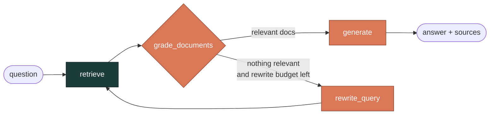
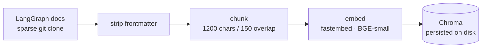

# 🔎 RAG LangGraph Agent

> An **agentic RAG** system over the [LangGraph](https://docs.langchain.com/oss/langgraph) documentation — an agent that retrieves, **reasons about whether its own retrieval is any good**, retries when it isn't, answers with citations, and is measured end-to-end by a versioned evaluation harness.

<p>
  <a href="https://github.com/PSURI1894/rag-langgraph-agent/actions/workflows/ci.yml"></a>
  
  
  
  
  
  
</p>

This project deliberately covers the **entire core loop of an applied-AI / LLM-engineering role** in one repo: document ingestion → vector retrieval → an agent that orchestrates and self-corrects → a measurable eval suite → a production-style API.

---

## Table of contents

- [What makes it *agentic*](#what-makes-it-agentic)
- [Architecture](#architecture)
- [Tech stack](#tech-stack)
- [Quickstart](#quickstart)
- [API reference](#api-reference)
- [Run with Docker](#run-with-docker)
- [Evaluation harness](#evaluation-harness)
- [Latest results](#latest-results)
- [Configuration](#configuration)
- [Testing](#testing)
- [Engineering notes](#engineering-notes)
- [Project layout](#project-layout)
- [Roadmap](#roadmap)

---

## What makes it *agentic*

A plain RAG pipeline retrieves once and hopes for the best. This agent **inspects the quality of its own retrieval and decides what to do next**:

1. It retrieves candidate chunks.
2. It asks the model to grade which of those chunks are *actually* relevant to the question.
3. If none are, and it still has budget, it **rewrites the query** into sharper terminology and tries again.
4. Only then does it answer — grounded strictly in the chunks it kept, with inline citations, and explicitly declining when the context doesn't support an answer.

That self-grade → retry → ground loop is the difference between "a vector search with an LLM stapled on" and an agent.

---

## Architecture

### The agent (a LangGraph `StateGraph`)



| Node | What it does | Powered by |
|---|---|---|
| `retrieve` | Similarity search over the vector store | Chroma + local `fastembed` embeddings |
| `grade_documents` | Returns the indices of chunks genuinely relevant to the question (structured output) | Claude |
| `rewrite_query` *(conditional)* | Reformulates the query into precise API/concept terms, then loops back to `retrieve` | Claude |
| `generate` | Answers using **only** the kept excerpts, cites them `[1]`,`[2]`, refuses to invent APIs | Claude |

### The ingestion pipeline



A deliberate design choice: **ingestion and retrieval require no API key.** Only generation and the LLM-judge evals call Claude — so anyone can clone the repo, build the index, and run the retrieval evals for free.

---

## Tech stack

| Concern | Choice | Why |
|---|---|---|
| Orchestration | **LangGraph** | Explicit state machine; conditional edges express the retry loop cleanly |
| LLM | **Claude `claude-opus-4-8`** via `langchain-anthropic` | Strong grading + grounded generation |
| Embeddings | **`fastembed` / BGE-small** | Local, ONNX, **no API key, no torch download, no GPU** |
| Vector store | **Chroma** | Zero-config local persistence |
| API | **FastAPI + Uvicorn** | Async, typed, auto OpenAPI docs |
| Config | **pydantic-settings** | Typed config from env / `.env` |
| Packaging | **uv** | Fast, reproducible, lockfile-backed |

---

## Quickstart

**Prerequisites:** [`uv`](https://docs.astral.sh/uv/) and `git`.

```bash
# 1. Install dependencies (creates a locked virtual env)
uv sync

# 2. Build the vector index — downloads the LangGraph docs, ~1 min, NO API key needed
uv run python -m rag_agent.ingest

# 3. (Optional) enable answering + generation evals
cp .env.example .env          # then set ANTHROPIC_API_KEY in .env

# 4. Run the API
uv run uvicorn rag_agent.api:app --reload
```

Ask a question:

```bash
curl -s localhost:8000/ask -H "content-type: application/json" \
  -d '{"question": "What is a checkpointer in LangGraph and why would I use one?"}'
```

```json
{
  "answer": "A checkpointer persists a snapshot of the graph state at each super-step [1]. It enables persistence features: resuming a conversation, human-in-the-loop interrupts, fault tolerance, and time travel [2] ...",
  "sources": [
    "https://docs.langchain.com/oss/langgraph/persistence",
    "https://docs.langchain.com/oss/langgraph/checkpointers"
  ],
  "rewrites": 0
}
```

> Interactive Swagger UI is at **http://localhost:8000/docs**.

---

## API reference

| Method | Path | Auth | Description |
|---|---|---|---|
| `GET` | `/healthz` | none | Liveness check; returns `{"status":"ok","indexed_chunks":N}` |
| `POST` | `/ask` | needs key | Runs the agent on `{"question": "..."}` → `{answer, sources, rewrites}` |
| `GET` | `/docs` | none | Auto-generated OpenAPI / Swagger UI |

The graph is built once at startup (FastAPI `lifespan`) and reused across requests. `/healthz` works **without** an API key; `/ask` returns a clean `503` if `ANTHROPIC_API_KEY` isn't configured.

---

## Run with Docker

The image **bakes the vector index in at build time** (ingestion runs during the build, no API key needed), so the container serves a populated `/healthz` the moment it starts.

```bash
# Build (downloads docs + embedding model, then indexes — a few minutes)
docker build -t rag-langgraph-agent .

# Run. /healthz works with no key; pass a key to enable /ask.
docker run --rm -p 8000:8000 \
  -e ANTHROPIC_API_KEY=sk-ant-... \
  rag-langgraph-agent
```

```bash
curl localhost:8000/healthz
# {"status":"ok","indexed_chunks":1130}
```

---

## Evaluation harness

Evaluation is treated as a first-class deliverable, not an afterthought. The dataset ([`evals/dataset.jsonl`](evals/dataset.jsonl)) is a **versioned** set of `question` / `reference_answer` / `must_retrieve` triples covering core LangGraph concepts. [`evals/run_evals.py`](evals/run_evals.py) scores two layers:

**Retrieval — deterministic, no API key:**
- **hit@k** — did a retrieved chunk contain the expected concept?
- **MRR** — how highly ranked was the first relevant chunk?

**Generation — LLM-as-judge, needs `ANTHROPIC_API_KEY`:**
- **correctness** — answer graded `1–5` against the reference answer.
- **faithfulness** — is every claim grounded in the retrieved excerpts (i.e. no hallucination)?
- **rewrite rate** — how often the agent had to reformulate its query.

```bash
uv run python evals/run_evals.py --retrieval-only   # free, deterministic
uv run python evals/run_evals.py                     # full suite (uses Claude)
uv run python evals/run_evals.py --limit 3           # quick smoke run
```

Each run writes a timestamped JSON + a `latest.md` summary to `evals/results/`.

### Latest results

<!-- EVAL_RESULTS_START -->
14 questions, `k=4`, generation + judges on `claude-opus-4-8`:

| Metric | Value |
|---|---|
| Retrieval hit@4 | **93%** (13/14) |
| Retrieval MRR | **0.774** |
| Correctness (LLM judge, 1–5) | **4.36** |
| Faithfulness rate | **93%** (13/14) |
| Query-rewrite rate | 0% |

**What the harness surfaced** — the value here is in the misses, not the averages:

- **It caught a hallucination.** On `streaming-modes` the agent invented two stream modes that don't exist plus a fictional "typed-projection API"; the correctness judge flagged it (scored 3). This is the single most important thing an eval suite buys you.
- **It caught a faithfulness leak.** The one faithfulness failure (`parallel-send`) was the agent citing a specific error code (`INVALID_CONCURRENT_GRAPH_UPDATE`) that wasn't in the retrieved excerpts — a subtle, plausible-sounding ungrounded claim.
- **Retrieval coverage, not reasoning, is the ceiling.** On `human-in-the-loop` and `parallel-send` the agent *correctly declined* to explain mechanics it couldn't retrieve (faithful, but lower correctness). The fix is better retrieval/chunking, and the metrics point straight at it.
- The `durable-execution` retrieval miss is a metric artifact: the concept lives on the *persistence*/*checkpointers* pages (which were retrieved), but those chunks lack the literal phrase, so the strict substring check flags it.

These are left in rather than tuned away — a suite that always scores 100% isn't measuring anything.
<!-- EVAL_RESULTS_END -->

### Optional: LangSmith tracing

Set `LANGSMITH_TRACING=true` and `LANGSMITH_API_KEY` in `.env` to trace every graph run in [LangSmith](https://smith.langchain.com) and inspect the full `retrieve → grade → rewrite → generate` trajectory. The repo runs fully without it.

---

## Configuration

All settings load from environment variables or a `.env` file (see [`.env.example`](.env.example)). Defaults shown.

| Variable | Default | Purpose |
|---|---|---|
| `ANTHROPIC_API_KEY` | — | Required for `/ask` and generation evals |
| `GENERATION_MODEL` | `claude-opus-4-8` | Model for grading, rewriting, answering |
| `JUDGE_MODEL` | `claude-opus-4-8` | Model for the LLM-as-judge evals |
| `EMBEDDING_MODEL` | `BAAI/bge-small-en-v1.5` | Local fastembed model |
| `RETRIEVAL_K` | `4` | Chunks retrieved per query |
| `MAX_QUERY_REWRITES` | `1` | Retry budget for the rewrite loop |

---

## Testing

```bash
uv run pytest
```

The suite validates the eval dataset's shape, the chunking/frontmatter logic, and the graph's wiring/routing — **all offline** (no network, no API key), so it runs anywhere including CI.

---

## Engineering notes

A few decisions worth calling out — the kind of thing that separates a demo from something maintainable:

- **Key-free by design.** The Claude clients are constructed *lazily*, at first node invocation rather than at graph-build time. This lets the FastAPI app start, serve `/healthz`, and run the retrieval evals with **no API key at all** — only the paths that actually call the model require one.
- **Local embeddings, deliberately.** Using `fastembed` (ONNX) instead of a hosted embedding API or a torch-backed model keeps ingestion free, offline, and dependency-light (no multi-gigabyte CUDA download).
- **A real dependency-resolution fix.** Chroma transitively pulled an ancient `opentelemetry-exporter-otlp-proto-grpc` that broke imports under modern protobuf; pinned via a `uv` override (see [`pyproject.toml`](pyproject.toml)) with a comment explaining why.
- **Honest evals.** Failing cases are documented, not tuned away — the README reports a hallucination and a faithfulness leak the suite caught.

---

## Project layout

```
src/rag_agent/
  config.py        # pydantic-settings configuration
  embeddings.py    # fastembed → LangChain Embeddings adapter
  vectorstore.py   # Chroma access
  ingest.py        # docs → chunks → Chroma
  graph.py         # the LangGraph agent (retrieve → grade → rewrite? → generate)
  api.py           # FastAPI service
evals/
  dataset.jsonl    # versioned eval set
  run_evals.py     # retrieval + generation metrics
tests/             # offline unit tests
```

---

## Roadmap

Natural next steps, in rough priority order:

- [x] **CI** (GitHub Actions): runs `pytest` + the retrieval-only evals on every push.
- [x] **Dockerfile** for one-command deployment of the API.
- [ ] **Better chunking** (header-aware splitting) to lift the retrieval-coverage gaps the evals flagged.
- [ ] **Streaming** `/ask` responses (Server-Sent Events) using LangGraph's `stream_mode`.
- [ ] **Hybrid retrieval** (BM25 + dense) and reranking.

---

## License

[MIT](LICENSE) © 2026 Parth Suri
